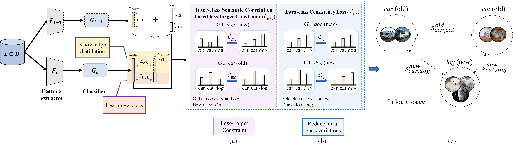
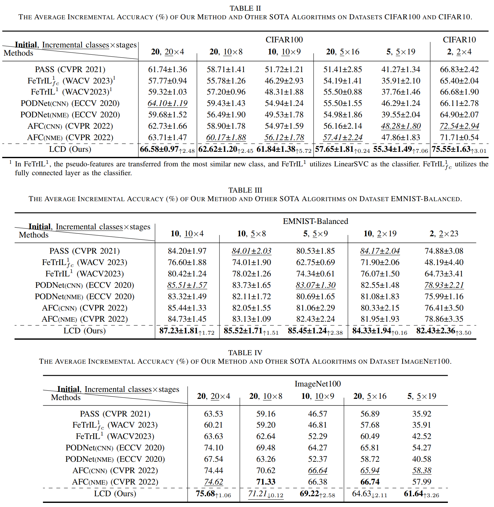
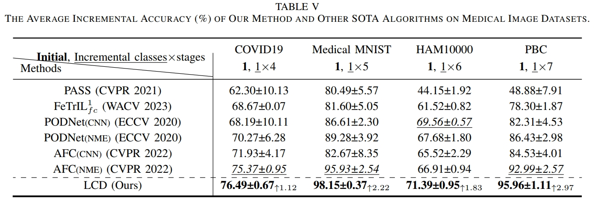

# LCD: Logits-with-Correlation-Based Distillation for Class Incremental Learning with Few Initial Classes

This is the implementation of our LCD methd (Logits-with-Correlation-Based Distillation for Class Incremental Learning with Few Initial Classes). <mark>(This repository is building....)</mark>

## Requirements
1. PyTorch 1.12.0

## Datasets
Four natural image datasets (including *CIFAR10*, *EMNIST-Balanced*, *CIFAR100*, and *ImageNet100*) and four medical image datasets (including *COVID19*, *Medical MNIST*, *HAM10000*, and *PBC*) are used for comparison. 

## Run 

## Experimental results

